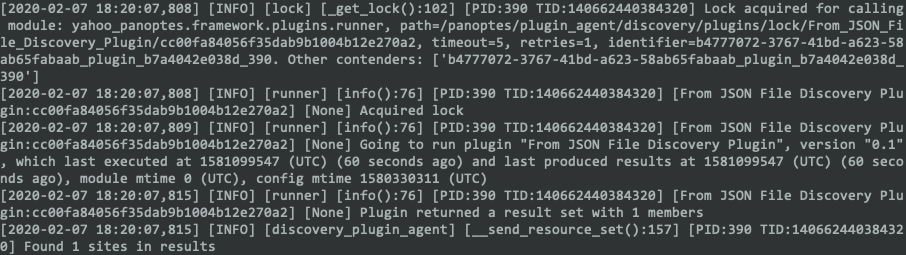
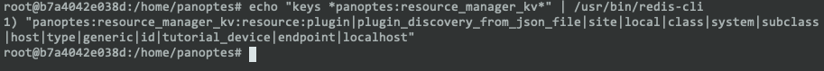
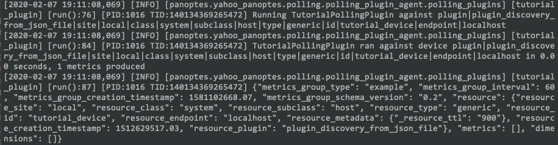
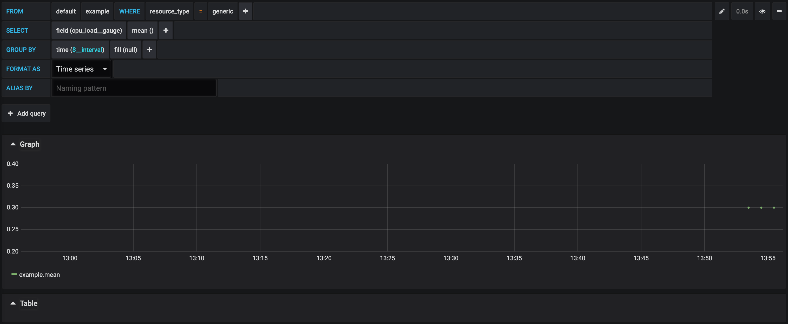

## Writing a Panoptes Polling Plugin

This is a very self-contained tutorial that doesn't model a normal fork, branch and pull request against the repository.

You'll start with three files: a plugin file, a panoptes-plugin configuration file, and a localhost.json file.   The 
panoptes plugin file is python, the configuration is text, and localhost.json, not surprisingly, is json.  We've 
provided the files below

Build yourself a directory someplace to hold these files while testing.

### The Tutorial Polling Plugin

We've provided a skeleton plugin to get started - paste this into `tutorial/tutorial_plugin.py`;

```python
from typing import Dict, Any
import time
from yahoo_panoptes.polling.polling_plugin import PanoptesPollingPlugin
from yahoo_panoptes.framework.metrics import PanoptesMetricsGroupSet, PanoptesMetricsGroup, \
    PanoptesMetric, PanoptesMetricType, PanoptesMetricDimension
from yahoo_panoptes.framework.plugins.context import PanoptesPluginContext
from yahoo_panoptes.framework.resources import PanoptesResource


class TutorialPollingPlugin(PanoptesPollingPlugin):
    """
    Only classes that inherit from PanoptesPollingPlugin are loaded. (Upstream Configuration Knobs Control This)
    """
    def __init__(self):
        self._plugin_context: PanoptesPluginContext = None
        self._config: Dict[str, Any] = {}
        self._panoptes_metrics_group_set: PanoptesMetricsGroupSet = PanoptesMetricsGroupSet()
        self._device: PanoptesResource = None
        self._execute_frequency: int = 60
        self._logger = None
        super(TutorialPollingPlugin, self).__init__()

    def populateMetricsGroupSetWithTimeSeries(self) -> None:
        """
        PanoptesMetricsGroupSet<set>{
            PanoptesMetricsGroup<dict>{
                dimensions<set>: {
                    PanoptesMetricDimension(name: str, value: str),
                    PanoptesMetricDimension(name: str, value: str),
                    ....
                },
                metrics<set>: {
                    PanoptesMetric(metric_name: str, metric_value: number, metric_type: {1: 'COUNTER', 0: 'GAUGE'}),
                    PanoptesMetric(metric_name: str, metric_value: number, metric_type: {1: 'COUNTER', 0: 'GAUGE'}),
                }
            },
            PanoptesMetricsGroup<dict>{...},
            PanoptesMetricsGroup<dict>{...}
        }

        Signatures:
            PanoptesMetricsGroup(resource: PanoptesResource, group_type: str, interval: int)
                - Timeseries container which is able to hold any number of metrics & dimensions.

            PanoptesMetricDimension(name: string_types, value: string_types)
            PanoptesMetric(metric_name: string_types, metric_value: number, metric_type: {1: 'COUNTER', 0: 'GAUGE'})
                - Note: Panoptes performs rate conversions specified in the .panoptes-plugin file

        The text above shows the structure of how time series data is stored within the PanoptesMetricsGroupSet.
        """
        pass


    def run(self, context: PanoptesPluginContext) -> PanoptesMetricsGroupSet:
        """
        This function is called by the runner.py::class PanoptesPluginRunner::execute_plugin()::177
        The PluginRunner creates an instance of the PanoptesPluginManager which recursively searches the directory tree
        and collects all .panoptes-plugin files, loading them into the PanoptesPluginInfo class. The PanoptesPluginInfo
        class contains all metadata associated with a plugin: last execution time, device to run the plugin against
        (if applicable), last results time, key value store, the zookeeper lock, along with a link to the plugin itself.
        The PluginManager uses these provided functions to verify that the plugin should be run. Once verifications
        are complete, a lock is acquired and this function called. The PanoptesMetricsGroupSet (timeseries container)
        object returned is passed to the callback function `_process_metrics_group_set`. The callback function emits
        the provided metrics groups set on to the message bus (Kafka).
        Returns:
            PanoptesMetricsGroupSet: Timeseries Container

            JSON from the PanoptesMetricsGroupSet created in the `populatedMetricsGroupSetWithTimeSeries` function.
        """
        self._plugin_context = context
        self._config = context.config
        self._logger = context.logger
        self._device = context.data
        self._execute_frequency = int(context.config['main']['execute_frequency'])

        self._logger.info("Running {} against {}".format(type(self).__name__, self._device))

        start_time = time.time()
        self.populateMetricsGroupSetWithTimeSeries()
        end_time = time.time()

        self._logger.info(
            "{} ran against device {} in {:.2f} seconds, {} metrics produced".format(
                type(self).__name__, self._device, end_time - start_time, len(self._panoptes_metrics_group_set))
        )

        return self._panoptes_metrics_group_set
        
```

### Tutorial .panoptes-plugin configuration file

We've also supplied a skeleton for the plugin configuration file.  Fill in your own Author and website details, it's 
your plugin.  The `Module` location is where on the inside of the panoptes_docker the plugin can be found.  We'll deal 
with that later, but trust us for the moment.

Save this file as `tutorial/tutorial_plugin.panoptes-plugin`.  We name the files the same out of convention, and use 
directories to separate and organize our plugins.

```bash
[Core]
Name = Tutorial Plugin
Module = /home/panoptes_v/lib/python3.6/site-packages/yahoo_panoptes/plugins/polling/tutorial_plugin/tutorial_plugin.py

[Documentation]
Author = <Your Name>
Version = 0.1
Website = github.com/<you>
Description = This is a tutorial plugin

[main]
execute_frequency = 60
resource_filter = resource_id = "tutorial_device"
namespace = metrics
```

## Tutorial localhost.json

Similarly, we've provided this file as well; paste into `conf/localhost.json`.
This file essentially contains details of a fictional device that is actually localhost.

The discovery plugin runs every 60 seconds and uses this file to queue devices for examination. Note that this is an 
array of objects.

```json
[
    {
        "resource_plugin": "plugin_discovery_from_json_file",
        "resource_site": "local",
        "resource_class": "system",
        "resource_subclass": "host",
        "resource_type": "generic",
        "resource_id": "tutorial_device",
        "resource_endpoint": "localhost",
        "resource_creation_timestamp": "1512629517.03121",
        "resource_metadata": {
            "_resource_ttl": "900"
        }
    }
]
```

Now you should have a full set of files and be ready to take the next step.

for example;
```
.
├── conf
│   └── localhost.json
└── tutorial
    ├── tutorial_plugin.py
    └── tutorial_plugin.panoptes-plugin
```

## Running the plugin against Panoptes Docker

We're going to assume that you've installed docker.  After that, you can run this in the same directory you used 
previously;

```bash
git clone https://github.com/yahoo/panoptes_docker.git && \
cd panoptes_docker && \
docker build . -t panoptes_docker && \
cd ..
```

This will build a local docker image.  What we're going to do next is overlay our `localhost.json` on the container's 
`localhost.json` and attach our test plugin to the correct place in the tree for Panoptes to pick up.  We'll do this 
through volume mounting.

```bash
docker run -d \
    --sysctl net.core.somaxconn=511 \
    --name="panoptes_docker" \
    --shm-size=2G \
    -v $PWD/tutorial:/home/panoptes_v/lib/python3.6/site-packages/yahoo_panoptes/plugins/polling/tutorial_plugin \
    -v $PWD/conf/localhost.json:/home/panoptes/conf/localhost.json \
    -p 127.0.0.1:8080:3000/tcp \
    panoptes_docker
```

At this point you should be able to check that the docker is running with `docker ps`.

## Verifying Success

All these tests take place inside the running container.  If you're seeing a super scary 'root' account, you're on the 
right track, otherwise 

```bash
docker exec -it panoptes_docker bash
```

### Checking the logs

Tail the discovery plugin agent logs and verify that the logged number of devices discovered is 1.  As you add 
devices, this will increase.

```bash
tail -f /home/panoptes/logs/discovery_plugin_agent.log
```



### Checking with Redis

Check redis with 

```bash
echo "keys *panoptes:resource_manager_kv*" | /usr/bin/redis-cli
```

and look for the **id|tutorial_device**



## Fleshing out our skeleton

Right now the skeleton plugin will only produce an empty set `{}`, but it's being picked up by the container.
This is because no time series data is ever added to `PanoptesMetricsGroupSet`

What we're going to do next is update the `populateMetricsGroupSetWithTimeSeries()` stub method.

Back out on your host, edit `tutorial/tutorial_plugin.py` and add the following under the method after removing `pass`.
It should look something like the following;

```python
def populateMetricsGroupSetWithTimeSeries(self) -> None:
    panoptes_metrics_group = PanoptesMetricsGroup(self._device, 'example', self._execute_frequency)
    self._panoptes_metrics_group_set.add(panoptes_metrics_group)
```

After around 60 seconds, the change should be picked up and run.  To see the output of this change, add the following 
to the end of the `run()` method in `tutorial/tutorial_plugin.py`, but before the return of 
**_panoptes_metrics_group_set**.

```python
for panoptes_metrics_group in self._panoptes_metrics_group_set:
    self._logger.info(panoptes_metrics_group.json)
```

This will send the results to the polling_plugins.log in the container.
To see the results, exec into the container (`docker exec -it panoptes_docker bash`), and tail the polling_plugins.log.

```bash
tail -f /home/panoptes/logs/polling_plugins.log
```



Or in a prettier format;

```json
{
  "metrics_group_type": "example",
  "metrics_group_interval": 60,
  "metrics_group_creation_timestamp": 1581102668.07,
  "metrics_group_schema_version": "0.2",
  "resource": {
    "resource_site": "local",
    "resource_class": "system",
    "resource_subclass": "host",
    "resource_type": "generic",
    "resource_id": "tutorial_device",
    "resource_endpoint": "localhost",
    "resource_metadata": {
      "_resource_ttl": "900"
    },
    "resource_creation_timestamp": 1512629517.03,
    "resource_plugin": "plugin_discovery_from_json_file"
  },
  "metrics": [],
  "dimensions": []
}
```

This is a great start, but there still isn't any meaningful information stored within the `MetricsGroup`. Extend the 
`populateMetricsGroupSetWithTimeSeries` method with some actual data;

```python
def populateMetricsGroupSetWithTimeSeries(self) -> None:
    panoptes_metrics_group = PanoptesMetricsGroup(self._device, 'example', self._execute_frequency)
    dimension = PanoptesMetricDimension('cpu_no', '5')
    panoptes_metrics_group.add_dimension(dimension)

    counter = PanoptesMetric('context_switch_count', 50, PanoptesMetricType.COUNTER)
    gauge = PanoptesMetric('cpu_load', .3, PanoptesMetricType.GAUGE)
    panoptes_metrics_group.add_metric(counter)
    panoptes_metrics_group.add_metric(gauge)

    self._panoptes_metrics_group_set.add(panoptes_metrics_group)
```

The plugin now returns the time series shown below.
```json
{
  "metrics_group_type": "example",
  "metrics_group_interval": 60,
  "metrics_group_creation_timestamp": 1581103268.057,
  "metrics_group_schema_version": "0.2",
  "resource": {
    "resource_site": "local",
    "resource_class": "system",
    "resource_subclass": "host",
    "resource_type": "generic",
    "resource_id": "tutorial_device",
    "resource_endpoint": "localhost",
    "resource_metadata": {
      "_resource_ttl": "900"
    },
    "resource_creation_timestamp": 1512629517.03,
    "resource_plugin": "plugin_discovery_from_json_file"
  },
  "metrics": [
    {
      "metric_creation_timestamp": 1581103268.058,
      "metric_name": "context_switch_count",
      "metric_value": 50,
      "metric_type": "counter"
    },
    {
      "metric_creation_timestamp": 1581103268.058,
      "metric_name": "cpu_load",
      "metric_value": 0.3,
      "metric_type": "gauge"
    }
  ],
  "dimensions": [
    {
      "dimension_name": "cpu_no",
      "dimension_value": "5"
    }
  ]
}
```

The plugin's callback function will place the output shown above on the message queue. This will be consumed by the 
downstream InfluxDB consumer.  The data is immediately graphable on Grafana.



You have now finished writing a basic Panoptes polling plugin.

## Additional Tips

### Counter/Rate transforms on data

Panoptes has built in support for counter / rate transformations. In order to tell the plugin runner to perform the 
transformations, add a `[transforms]` key to the `.panoptes-plugin` configuration file and under it, add the metric names 
in the following format: `<metrics_group_type> = rate:<resulting_metrics_group_type>:<COUNTERNAMES>`. 

For the example above, it would be `example = rate:example:context_switch_count`.

```bash
[main]
execute_frequency = 60
resource_filter = resource_id = "tutorial_device"
namespace = metrics

[transforms]
example = rate:example:context_switch_count

```

### Making API calls

Plugins can do anything a python function and class can do. While Panoptes was built for the purpose of network 
monitoring, its applicable scope isn't limited there. 

If you would like to extend your plugin to make an API call you can add the skeleton code below inside the plugin.

```python
import requests
def makeAPICall(self) -> Any:
        try:
            response = requests.get('API Endpoint')
            response.raise_for_status()
        except (HTTPError, Timeout, ConnectionError):
            return 10000

        return response.<data>
        
def populateMetricsGroupSetWithTimeSeries(self) -> None:
        api_call_metrics_group = PanoptesMetricsGroup(self._device, 'panoptes_api_test', self._execute_frequency)
        bitcoin_price_metrics_group.add_dimension(PanoptesMetricDimension('call', 'first'))  # (self, name, value)
        bitcoin_price_metrics_group.add_metric(PanoptesMetric('api_data', self.makeAPICall(),
                                                              PanoptesMetricType.GAUGE))
        self._panoptes_metrics_group_set.add(api_call_metrics_group)
```
