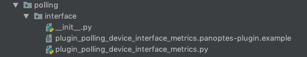

Plugins in Panoptes are the key to it's extensibility. In a nutshell, plugins are Python classes which implement 
well-known interfaces and produce well-known Python objects as results relevant to the type of plugin.

### Configuration And Code

Plugins are defined by two files: a configuration file and a file that contains the actual code of the plugin.

#### Configuration
The configuration file for a plugin is an ini style file which contains, amongst other things, the location of the code
file. The default extension for plugin configuration files is `.panoptes-plugin` - although this can be changed from 
the site wide configuration file. 

Example plugin configuration files can be found in the
[examples/plugins](https://github.com/yahoo/panoptes/tree/master/examples/plugins) directory of the main git repo.

`[Core]` and `[Documentation]` are mandatory sections in a plugin configuration file. In addition, the 
`exequte_frequency` in the `[main]` section of a plugin configuration file is mandatory as well - this is the 
time, in seconds, of how frequently the plugin should be executed.

#### Code

The plugin configuration file __must__ contain the fully qualified path for the plugin module in `[Core]` section.
This module should contain at least one class derived from one of the three plugin type classes
(PanoptesDiscoveryPlugin, PanoptesEnrichmentPlugin, PanoptesPollingPlugin).

If may not be obvious from the preceding descriptions, but multiple plugin configuration files can point to the same
module but with different plugin configs - for example, the resource_filter could be different for each plugin
configuration.

### Scheduler

Plugins are discovered by a 'plugin scheduler' - it scans the directories listed in the site wide configuration file 
for plugin configuration files and if the plugins can be successfully loaded (no configuration or code errors),
then it schedules the plugins to be executed. 

'Scheduling' a plugin means that the task is added to Celery on the appropriate queue and with the appropriate 
arguments.

### Agent

A plugin agent is a process which actually runs plugins - it spawns multiple sub-processes, watches the Celery queue
for the next task to execute, loads and runs a plugin and handles the plugins' output appropriately.

A plugin agent implements a couple of safety guards:

* It takes global distributed lock on plugin/resource combination before execution - so if the same plugin is running
against the same resource, another instance of the plugin would not be run against the same resource
* It does not execute a plugin which was executed less than `execute_frequency` seconds ago against the same resource

Both of these are to ensure that resources are not 'hammered' in any way - this is specially needed for network devices
which can be DOS'ed unintentionally by over-polling.

### Security

Since plugins are Python code that can do __anything__ that the user which the plugin agent is running as is capable of
and they run in the context of shared processes, it is extremely important to review any plugins before deciding to run
them in your setup.

